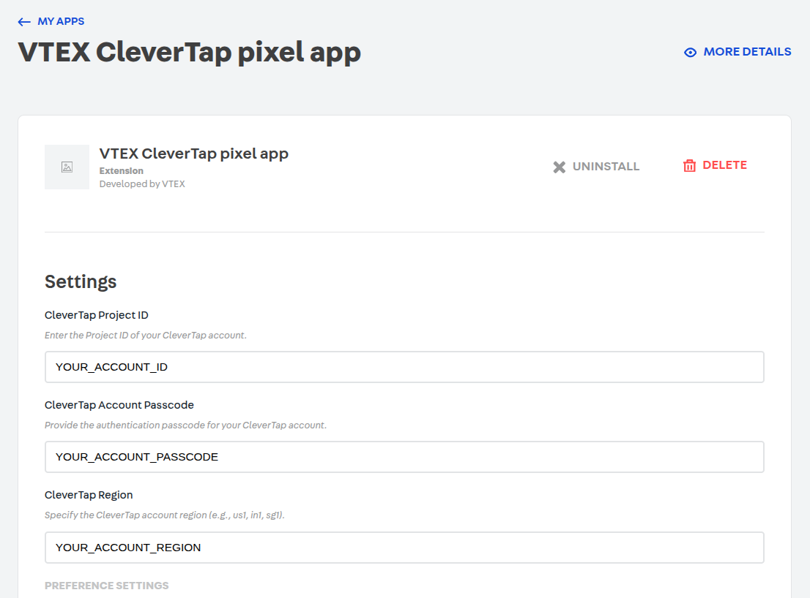
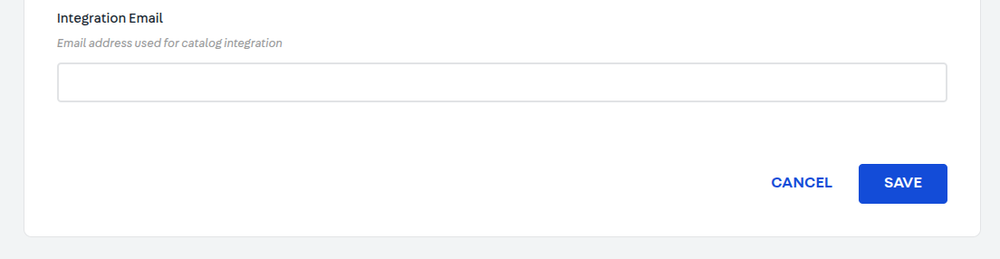
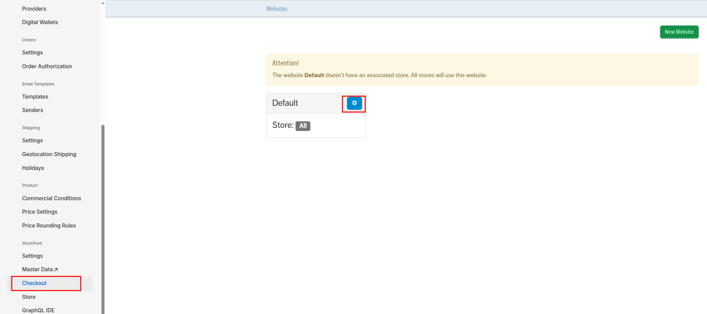
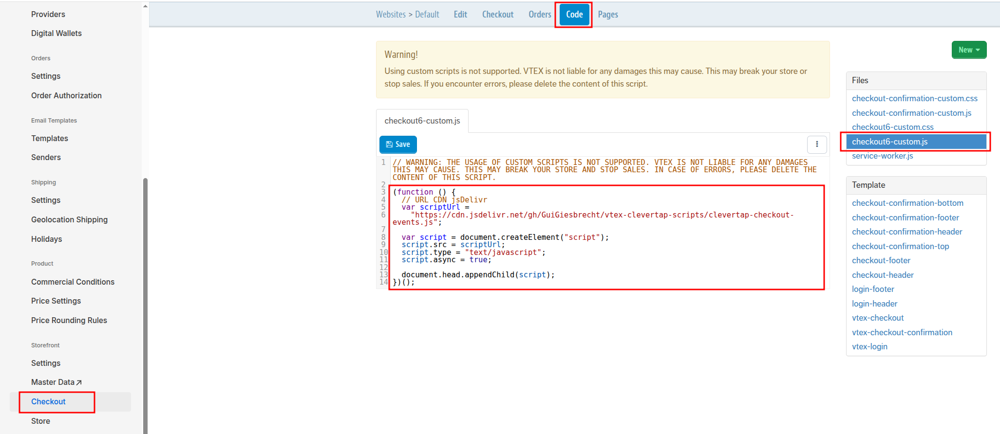
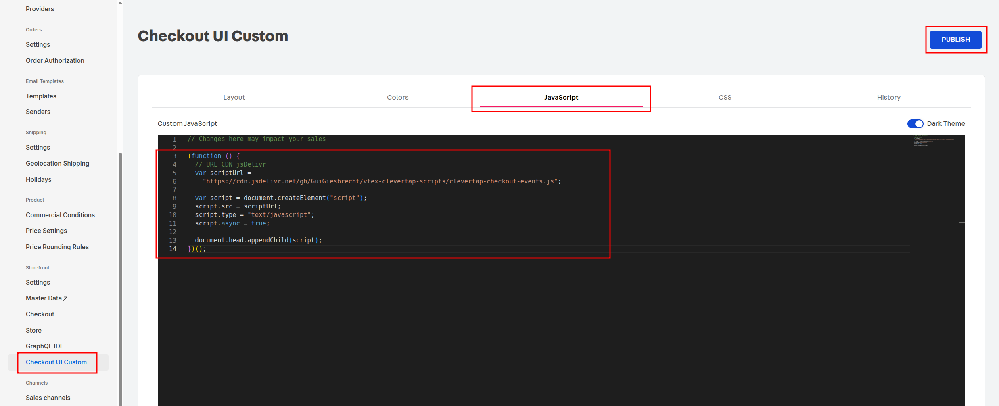
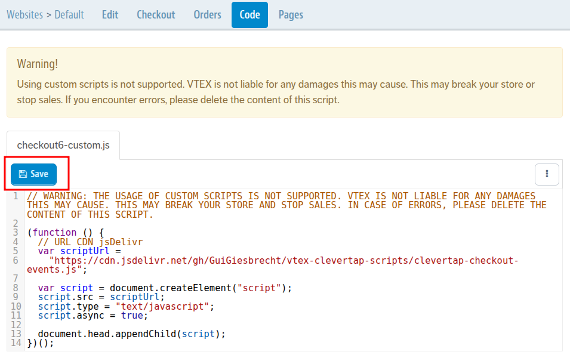
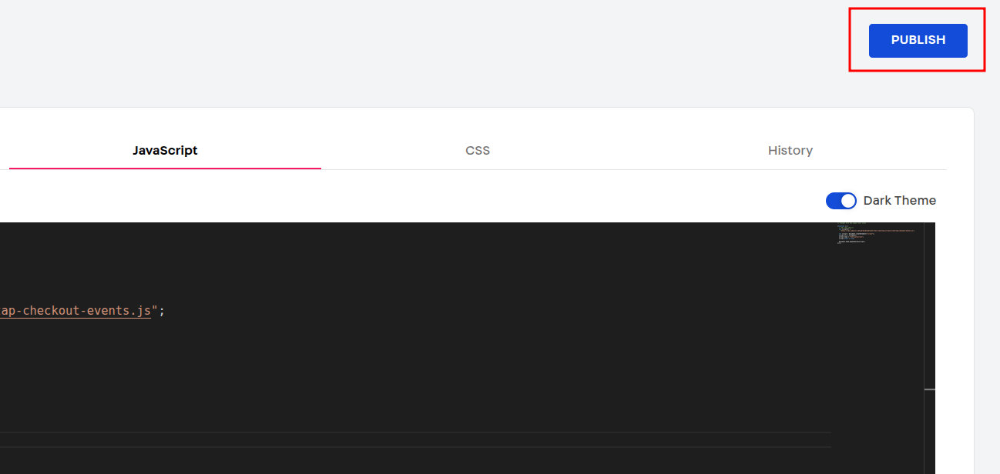

# Overview

The **VTEX CleverTap pixel app** provides a seamless way to connect your VTEX store to CleverTap in just a few minutes. Once connected, the app automatically tracks user and ecommerce events (such as product views, cart actions, and purchases) and sends them to CleverTap — enabling powerful segmentation, personalization, and campaign automation.

With this integration, you can:

- Capture real-time events and user activity from VTEX.
- Analyze user journeys directly within the CleverTap dashboard.
- Send personalized messages through [Web Push](https://docs.clevertap.com/docs/web-push), [Web Pop-ups](https://docs.clevertap.com/docs/web-pop-up), [Web Exit Intent](https://docs.clevertap.com/docs/web-exit-intent-overview), and [Web Native Display](https://docs.clevertap.com/docs/web-native-display).

---

# Integrate VTEX with CleverTap

The VTEX CleverTap pixel app can be installed directly from your VTEX Admin.
After installation, you’ll enter your **CleverTap credentials** to start sending store data.

The integration process includes:

1. [Install the CleverTap App](#1-install-the-vtex-clevertap-app)
2. [Add Your CleverTap Credentials](#2-add-clevertap-credentials-in-vtex)
3. [Insert Checkout Script (Required)](#3-insert-clevertap-checkout-script-required)
4. [Verify Event Tracking](#4-verify-event-tracking)
5. [Advanced Customization](#5-advanced-customization)
6. [Use Cases: Cart Abandonment & Web Campaigns](#6-cart-abandonment-and-web-campaigns)

---

## 1. Install the VTEX CleverTap App

You can install the app directly from your VTEX Admin.

1. Log in to your VTEX Admin:
   `https://{your-account}.myvtex.com/admin`
2. Navigate to **Apps → App Store**.
3. Search for **CleverTap Pixel App**.


4. Click **Install** and confirm.

Once the installation is complete, you'll see the app under **My Apps**.


---

## 2. Add CleverTap Credentials in VTEX

After installing the app, you’ll configure it by entering your **CleverTap account details** inside VTEX — not the other way around.

1. Go to **Apps → My Apps → VTEX CleverTap Pixel App**.
2. Under **Settings**, fill in the following fields:

| Field                          | Description                                                                                     |
| ------------------------------ | ----------------------------------------------------------------------------------------------- |
| **CleverTap Project ID**       | Found in your CleverTap dashboard under **Settings → Project → Details** (e.g., `867-848-W57Z`) |
| **CleverTap Account Passcode** | The authentication key for your CleverTap account (found in the same Project settings)          |
| **CleverTap Region**           | Your CleverTap account region (e.g., `us1`, `in1`, `sg1`)                                       |



3. Under **Preference Settings**, you can choose whether to:

   - **Allow Events from Unknown Users** – enables anonymous browsing event tracking.

   - **Track Events**, select which events you’d like CleverTap to collect:

     - Products Searched
     - Product Filtered By Category
     - Product List Viewed
     - Promotion Viewed
     - Promotion Clicked
     - Product Viewed
     - Product Clicked
     - Product Added To Cart
     - Product Removed From Cart
     - Cart Viewed
     - Product Added to Wishlist
     - Product Removed from Wishlist
     - Product Shared
     - Order Created
     - Checkout Product Added To Cart
     - Checkout Product Removed From Cart
     - Checkout Cart Viewed
     - Checkout Started
     - Payment info
     - Checkout Step Viewed/Completed
     - Coupon Applied
     - Coupon Denied

     > ✅ These are the same events CleverTap uses to power product analytics, cart abandonment, and funnel tracking.

   - **Active Catalog Sync**, enable this option to automatically sync the Clevertap catalog every 24 hours. Once activated, adding an **Integration Email** becomes mandatory.

   - **Integration Email**, email address used for catalog integration — this is the address where the synchronization results will be sent.

4. Click **Save** to activate the configuration.



Once saved, your VTEX store will automatically start sending events to CleverTap.

---

## 3. Insert CleverTap Checkout Script (Required)

VTEX’s checkout operates independently from the storefront.
To ensure CleverTap receives **checkout, order, and payment events**, you must add a small script tag to the Checkout configuration in VTEX.

### Steps

1. Go to your VTEX Admin:
   `https://{your-account}.myvtex.com/admin`

2. Navigate to:
   **Store Settings → Checkout → Code → checkout6-custom.js**





2.1 - In some VTEX Admin versions, this may appear under “Checkout UI Custom” **Store Settings → Checkout UI Custom → JavaScript**



3. Insert the following script:

```js
;(function () {
  // URL CDN jsDelivr
  var scriptUrl =
    'https://cdn.jsdelivr.net/gh/GuiGiesbrecht/vtex-clevertap-scripts/clevertap-checkout-events.js'

  var script = document.createElement('script')
  script.src = scriptUrl
  script.type = 'text/javascript'
  script.async = true

  document.head.appendChild(script)
})()
```

4. Save or publish the checkout configuration.



OR



---

### Why This Step is Crucial

Without this script:

- Checkout actions (Checkout Product Added To Cart, Checkout Product Removed From Cart, Checkout Cart Viewed, Checkout Started, Payment info, Checkout Step Viewed/Completed, Coupon Applied, Coupon Denied) will not be tracked.
- Cart abandonment and conversion funnel analytics will be incomplete.

Adding this script ensures CleverTap receives the full buying journey — from browse to checkout to purchase.

---

## 4. Verify Event Tracking

To confirm that the integration is working:

1. Open your VTEX storefront and perform test actions (search, view product, add to cart, start checkout, complete order).
2. Go to your CleverTap dashboard → **Events**.
3. You should see events like:

   - `Product Viewed`
   - `Added to Cart`
   - `Checkout Started`
   - `Order Completed`

If events are missing:

- Re-check that the **checkout script** is installed.
- Make sure your VTEX account settings match your CleverTap credentials.
- Clear VTEX workspace cache and reload.

---

## 5. Advanced Customization

Once your store is connected, you can customize tracking and campaigns from CleverTap.

### Configure Web Push

1. In CleverTap, navigate to **Settings → Channels → Web Push**.
2. Configure your domain and permission prompt.
3. Enable “Send Notification Permission Prompt” to allow browser notifications.

Once enabled, CleverTap can send **personalized push notifications** to VTEX store visitors.

---

### Customize Event Data

You can enable or disable which VTEX events CleverTap should receive.

1. In VTEX Admin → **My Apps → CleverTap Pixel App → Settings**
2. Toggle events ON or OFF under **Track Events**.

This lets you control which parts of the user journey CleverTap records.

---

### Profile Properties Synced

The VTEX CleverTap app automatically sends customer details as **CleverTap Profile Properties**, including:

| Property               | Description           |
| ---------------------- | --------------------- |
| Email                  | Customer email        |
| Phone                  | Customer phone number |
| First Name / Last Name | Customer name         |
| Geolocation            | Geolocation infos     |

---

## 6. Cart Abandonment and Web Campaigns

Once VTEX data is flowing into CleverTap, you can create **dynamic cart abandonment campaigns**.

### How It Works

- **Cart Events:** Captured automatically by the VTEX pixel app.
- **Checkout Events:** Captured through the added checkout script.
- **Product Catalog:** Synced through VTEX APIs, enabling dynamic product personalization.

---

# FAQs

### Do I need to configure anything inside CleverTap?

No. Configuration is done **entirely in VTEX** — you only need your **Project ID, Passcode, and Region** from CleverTap.

---

### Does this integration work with all VTEX stores?

It supports **VTEX IO** stores.

---

### What events are supported?

All standard ecommerce events:

- Products Searched
- Product Filtered By Category
- Product List Viewed
- Promotion Viewed
- Promotion Clicked
- Product Viewed
- Product Clicked
- Product Added To Cart
- Product Removed From Cart
- Cart Viewed
- Product Added to Wishlist
- Product Removed from Wishlist
- Product Shared
- Order Created
- Checkout Product Added To Cart
- Checkout Product Removed From Cart
- Checkout Cart Viewed
- Checkout Started
- Payment info
- Checkout Step Viewed/Completed
- Coupon Applied
- Coupon Denied

---

# Summary

✅ **Install the VTEX CleverTap pixel app**
✅ **Enter your CleverTap credentials inside VTEX**
✅ **Add the checkout script** (crucial for complete funnel tracking)
✅ **Verify events in CleverTap**
✅ **Create personalized campaigns**

Once complete, you’ll have a fully automated connection between your VTEX store and CleverTap, enabling data-driven marketing and personalized customer engagement.
