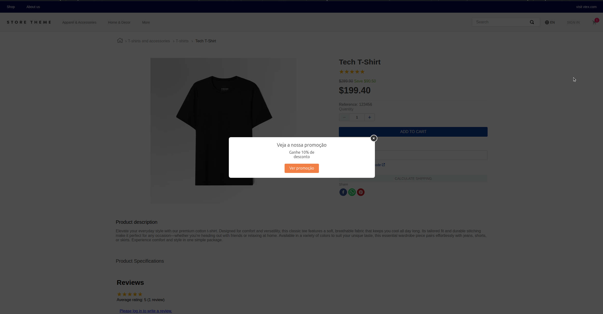
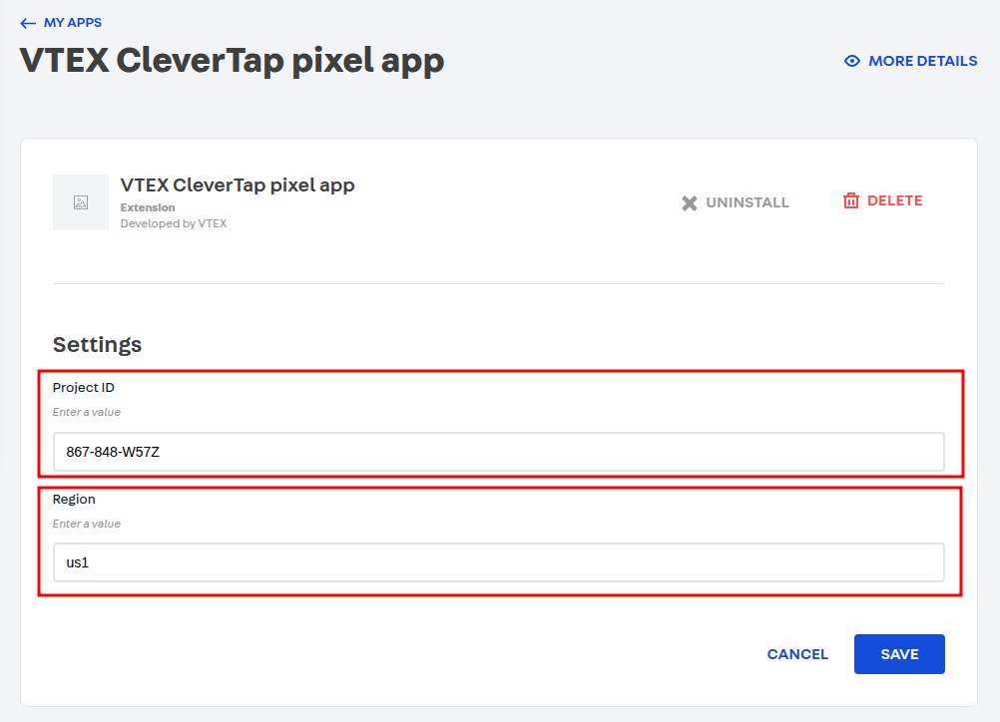

📢 Use this project, [contribute](https://github.com/vtex-apps/CHANGEME) to it or open issues to help evolve it using [Store Discussion](https://github.com/vtex-apps/store-discussion).

# VTEX CleverTap Pixel App

<!-- DOCS-IGNORE:start -->
<!-- ALL-CONTRIBUTORS-BADGE:START - Do not remove or modify this section -->
[](#contributors-)
<!-- ALL-CONTRIBUTORS-BADGE:END -->
<!-- DOCS-IGNORE:end -->

The **VTEX CleverTap Pixel App** is a VTEX IO app that integrates CleverTap tracking into your store. It enables the tracking of user behavior, checkout steps, order lifecycle events, wishlist interactions, promotions, and more. This helps marketing teams better understand customer behavior and improve engagement through personalized messaging and analytics.

Next, you can **see a visual example** of how the app works in practice:  



---

## Configuration

1. Install the app via VTEX IO:  

```bash
vtex install vtex-clevertap-app@0.x
```

2. Access the **Apps** section in your admin panel and open the **VTEX CleverTap pixel app**.  
3. Enter your **Project ID** and **Region**.  
4. Click **Save**.



---

## How it Works

The app tracks events across multiple store activities

---

## Event Summary

You can find a detailed [Event Summary Table](./events-summary.md) with all events, status, and missing fields.

---

## Contributing

If you want to contribute to this project, feel free to submit issues, feature requests, or pull requests.  

This project follows the [all-contributors](https://github.com/all-contributors/all-contributors) specification. Contributions of any kind are welcome!  

<!-- DOCS-IGNORE:start -->
## Contributors ✨

Thanks goes to these wonderful people ([emoji key](https://allcontributors.org/docs/en/emoji-key)):

<!-- ALL-CONTRIBUTORS-LIST:START - Do not remove or modify this section -->
<!-- prettier-ignore-start -->
<!-- markdownlint-disable -->
<!-- markdownlint-enable -->
<!-- prettier-ignore-end -->
<!-- ALL-CONTRIBUTORS-LIST:END -->

This project follows the [all-contributors](https://github.com/all-contributors/all-contributors) specification. Contributions of any kind are welcome!
<!-- DOCS-IGNORE:end -->
